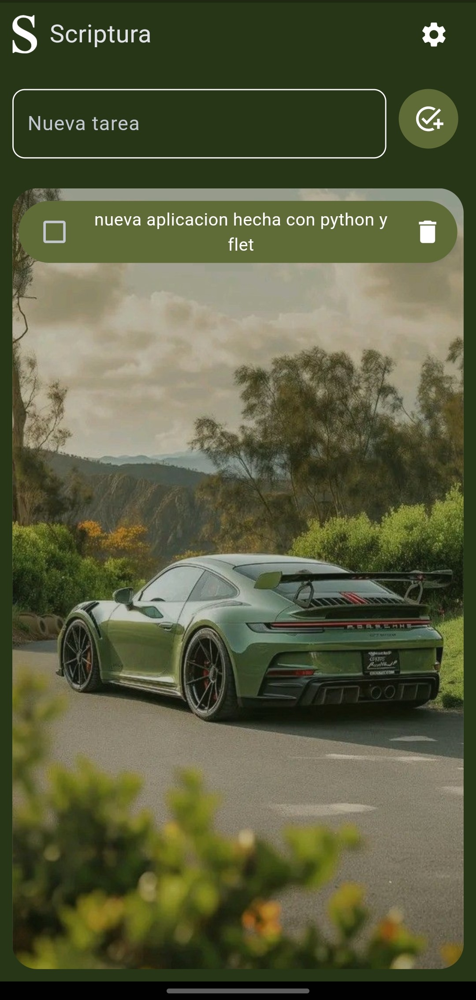

# Scriptura app

Aplicación de tareas sencilla con Flet y Python


- [Scriptura app](#scriptura-app)
- [Desarrollo](#desarrollo) 
- [Android](#android) 
  - [Download](#download)
  - [Cambiar wallpaper](#cambiar-fondo-de-pantalla)
- [Windows](#windows) 

- [iOS](#ios) 
- [Changelog](#changelog)
- [Soporte](#soporte)
- [Más](#mas)
# Desarrollo

Para iniciar la aplicacion en modo desarrollo

Instalar las dependencias:
```
pip install flet
```

Iniciar:

```
flet main.py
```

O instala la aplicación compilada:

# Android 



## Download

You can install scriptura app in your smarthpone android 

**Download here:**

<button>[Download]()</button>

[def]: "docs\screenshot_1.jpg"


## Cambiar fondo de pantalla

1. Dirigete a ajustes en el icono de engrane
2. Selecciona la opción "cambiar fondo"
3. Selecciona la imagen de tu preferencia
4. Regresa al menú con el icono de flecha

# Windows

Aun no hay compilacion de descarga para windows
pero es posible utilizar y compilar la aplicacion directamente la herramienta:
```
flet pack
```
La cual requiere las siguientes dependencias:
```
pip install pyinstaller
```

Para una simple compilación usar: 
```
flet pack your_program.py
```

para mas información de como compilar una app customizable visita la documentación oficial:

https://flet.dev/docs/cookbook/packaging-desktop-app/

# iOS

No existe actualmente una aplicación para iOS actualmente

# Changelog

- 08/11/2024 v1.0.0 primera aplicación en producción  

# Soporte

Cualquier bug o problema en la aplicación explicarlo en la sección **issues** de este repositorio

# Mas 

Puede observar este y otros proyectos en mi pagina web [christianymoon.github.io](https://christianymoon.github.io) 

- [Blogs](https://christianymoon.github.io/blog/index.html)
- [Proyectos](https://christianymoon.github.io/index.html#projects)
- [Repositorios](https://christianymoon.github.io/projects/index.html)

